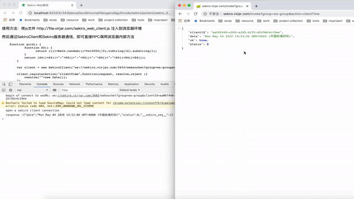

# sekiro

SEKIRO 是一个android下的API服务暴露框架，可以用在app逆向、app数据抓取、android群控等场景。

Sekiro是我之前设计的群控系统 [Hermes](https://gitee.com/virjar/hermesagent) 的升级版，和其他群控框架相比的特点如下：

1. 对网络环境要求低，sekiro使用长链接管理服务，使得Android手机可以分布于全国各地，甚至全球各地。手机掺合在普通用户群体，方便实现反抓突破，更加适合获取下沉数据。
2. 不依赖hook框架，就曾经的Hermes系统来说，和xposed框架深度集成，在当今hook框架遍地开花的环境下，框架无法方便迁移。所以在Sekiro的设计中，只提供了RPC功能了。
3. 纯异步调用，在Hermes和其他曾经出现过的框架中，基本都是同步调用。虽然说签名计算可以达到上百QPS，但是如果用来做业务方法调用的话，由于调用过程穿透到目标app的服务器，会有大量请求占用线程。系统吞吐存在上线(hermes系统达到2000QPS的时候，基本无法横向扩容和性能优化了)。但是Sekiro全程使用NIO，理论上其吞吐可以把资源占满。
4. client实时状态，在Hermes系统我使用http进行调用转发，通过手机上报心跳感知手机存活状态。心跳时间至少20s，这导致服务器调度层面对手机在线状态感知不及时，请求过大的时候大量转发调用由于client掉线timeout。在Sekiro长链接管理下，手机掉线可以实时感知。不再出现由于框架层面机制导致timeout


# 部署流程

部署区分服务器端部署和客户端部署，服务器使用SpringBoot实现，占三个端口(``server.port: http管理端，同步http``| ``natServerPort:手机nat穿透端，和手机长链接``| ``natHttpServerPort:NIO的http服务端，只提供RPC调用入口``)
手机端一般附加在apk代码逻辑中。

## 服务端部署

两种方式，基于源码部署和jar包运行

### 源码部署服务器
执行脚本 ``./runProd.sh``即可，不过在服务器，由于gradle项目存在Android端，所以需要配置Androidsdk环境


```
#安装sdkman
curl -s "https://get.sdkman.io" | bash
source "$HOME/.sdkman/bin/sdkman-init.sh"
#安装gradle
sdk install gradle 4.4

#下载并解压android sdk
wget http://dl.google.com/android/android-sdk_r24.4.1-linux.tgz
tar -zvxf android-sdk_r24.4.1-linux.tgz
#设置环境变量

echo "export ANDROID_HOME=path/to/android-sdk-linux" >> /etc/profile
echo "export PATH=$ANDROID_HOME/tools:$PATH"
source /etc/profile

#安装sdk
android list sdk --all
android update sdk -u --all --filter 7  #选择对应sdk的编号，我这边装的27.0.3 对应编号7

# 如果出现
# Failed to install the following Android SDK packages as some licences have not been accepted.
#      build-tools;28.0.3 Android SDK Build-Tools 28.0.3
#   To build this project, accept the SDK license agreements and install the missing components using the Android Studio SDK Manager.
#   Alternatively, to transfer the license agreements from one workstation to another, see http://d.android.com/r/studio-ui/export-licenses.html
# 那么执行
android update sdk -u --all --filter itemId(在--all里面，缺少那个选择那个)
```

之后再次执行脚本  ``./runProd.sh``即可

### jar包部署

1. 当前目录执行代码: ``./gradlew sekiro-server:bootJar``  即可在 `` sekiro-server/build/libs/sekiro-server-0.0.1-SNAPSHOT.jar``找到all-in-one的jar包
2. 通过命令 ``nohup java -jar sekiro-server/build/libs/sekiro-server-0.0.1-SNAPSHOT.jar >/dev/null 2>&1  &`` 即可启动服务器

### docker 部署
参见项目: https://github.com/virjar/sekiro-server  ~~https://github.com/lbbniu/sekiro-server~~

### 端口配置

在``sekiro-server/src/main/resources/appliation.properties``中可以配置三个服务端端口


## client使用

需要注意，client api发布在maven仓库，而非jcenter仓库
```
dependencies {
    implementation 'com.virjar:sekiro-api:1.0.1'
}
```

然后即可在apk代码中书写调用服务逻辑:
```
SekiroClient.start("sekiro.virjar.com",clientId,"sekiro-demo")
        .registerHandler("clientTime",new SekiroRequestHandler(){
            @Override
            public void handleRequest(SekiroRequest sekiroRequest,SekiroResponse sekiroResponse){
                    sekiroResponse.success(" now:"+System.currentTimeMillis()+ " your param1:" + sekiroRequest.getString("param1"));
            }
        });

```
安装apk到手机，并打开，然后可以通过服务器访问这个接口

```
http://sekiro.virjar.com/groupList

{"status":0,"message":null,"data":["sekiro-demo"],"clientId":null,"ok":true}


http://sekiro.virjar.com/natChannelStatus?group=sekiro-demo
{"status":0,"message":null,"data":["2e77bbfa_869941041217576"],"clientId":null,"ok":true}


http://sekiro.virjar.com/invoke?group=sekiro-demo&action=clientTime&param1=%E8%87%AA%E5%AE%9A%E4%B9%89%E5%8F%82%E6%95%B0

{"clientId":"2e77bbfa_869941041217576","data":"process: com.virjar.sekiro.demoapp : now:1570546873170 your param1:自定义参数","ok":true,"status":0}

http://sekiro.virjar.com/asyncInvoke?group=sekiro-demo&action=clientTime&param1=%E8%87%AA%E5%AE%9A%E4%B9%89%E5%8F%82%E6%95%B0

{"clientId":"2e77bbfa_869941041217576","data":"process: com.virjar.sekiro.demoapp : now:1570897005965 your param1:自定义参数","ok":true,"status":0}
```
client demo在``app-demo``子工程可以看到，直接运行app-demo，即可在 sekiro.virjar.com看到你的设备列表

# 在类似xposed的代码注入框架中使用Sekiro

Sekiro本身不提供代码注入功能，不过Sekiro一般需要和代码注入框架配合产生作用，如和Xposed配合，可以方便调用app内部私有API，一般情况下，在Xposed入口启动Sekiro，然后接受服务器指令,并将参数转发到app内部。

Sekiro调用真实apk的例子： *为避免风险，现已经移除Demo*


# 服务器异步http

sekiro框架在http服务模块，提供了两个http端口，分别为BIO和NIO模式，其中BIO模式提供给tomcat容器使用，为了方便springBoot集成。另一方面，NIO提供给调用转发模块，NIO转发过程并不会占用线程池资源，理论上只对连接句柄和CPU资源存在瓶颈。

sekiro的这两个服务分别占用两个不同端口，分别为:
```
#tomcat 占用端口
server.port=5602
#长链接服务占用端口
natServerPort=5600
# 异步http占用端口
natHttpServerPort=5601
```

同时两个请求的uri也有一点差异，分别为,

BIO:  http://sekiro.virjar.com/invoke?group=sekiro-demo&action=clientTime&param1=%E8%87%AA%E5%AE%9A%E4%B9%89%E5%8F%82%E6%95%B0

NIO:  http://sekiro.virjar.com/asyncInvoke?group=sekiro-demo&action=clientTime&param1=%E8%87%AA%E5%AE%9A%E4%B9%89%E5%8F%82%E6%95%B0

可以看到sekiro的demo网站中，都是占用了统一个端口，这是因为存在ngnix转发，你可以参照如下配置实现这个效果:
```
upstream sekiro_server {
  server 127.0.0.1:5602;
}

upstream sekiro_nio {
  server 127.0.0.1:5601;
}

server {
  listen 0.0.0.0:80;
  listen [::]:80;
  server_name sekiro.virjar.com;
  server_tokens off;

  real_ip_header X-Real-IP;
  real_ip_recursive off;


location / {
    client_max_body_size 0;
    gzip off;

    proxy_read_timeout      300;
    proxy_connect_timeout   300;
    proxy_redirect          off;

    proxy_http_version 1.1;

    proxy_set_header    Host                $http_host;
    proxy_set_header    X-Real-IP           $remote_addr;
    proxy_set_header    X-Forwarded-For     $proxy_add_x_forwarded_for;
    proxy_set_header    X-Forwarded-Proto   $scheme;

    proxy_pass http://sekiro_server;
  }

location /asyncInvoke {
    client_max_body_size 0;
    gzip off;

    proxy_read_timeout      300;
    proxy_connect_timeout   300;
    proxy_redirect          off;

    proxy_http_version 1.1;

    proxy_set_header    Host                $http_host;
    proxy_set_header    X-Real-IP           $remote_addr;
    proxy_set_header    X-Forwarded-For     $proxy_add_x_forwarded_for;
    proxy_set_header    X-Forwarded-Proto   $scheme;

    proxy_pass http://sekiro_nio;
  }
}
```

强烈建议使用NIO接口访问调用服务

# 接口说明

## 基本概念解释
在Sekiro定义中，有几个特殊概念用来描述手机或者业务类型。了解如何使用Sekiro之前需要知道这几个概念的含义。


### group
group的作用是区分接口类型，如在sekiro系统中，存在多个不同app的服务，那么不同服务通过group区分。或者同一个app的服务也可能存在差异，如登陆和未登陆分不同接口组，签名计算和
数据请求调用区分不同接口组。Sekiro不限定group具体含义，仅要求group作为一个唯一字符串，使用方需要自行保证各自group下是的手机业务唯一性。

备注：曾经的Hermes系统中，接口组定义为app的packageName，导致同一个app的需求，无法进行二次路由，签名计算和数据调用无法隔离。登陆和未登陆手机无法区分

### action

action代表group下的不同接口，可以把group叫做接口组，action代表接口。Sekiro的服务调用路由最终到达action层面，实践经验一般来说同一个app，或者说同一个业务，大多需要同时
暴露多个接口。action最终会映射到一个固定的java handler class下。
```
SekiroClient.start("sekiro.virjar.com",clientId,"sekiro-demo")
        .registerHandler("clientTime",new SekiroRequestHandler(){
            @Override
            public void handleRequest(SekiroRequest sekiroRequest,SekiroResponse sekiroResponse){
                    sekiroResponse.success(" now:"+System.currentTimeMillis()+ " your param1:" + sekiroRequest.getString("param1"));
            }
        });

```

demo代码中，会在group:``sekiro-demo``下暴露一个action为:``clientTime``的服务。

### clientId
clientId用于区分不同手机，同一个接口可以部署在多个手机上，Sekiro会通过轮询策略分配调用流量(暂时使用轮询策略),客户端需要自行保证clientId唯一。如果你没有特殊需要，可以通过AndroidId，也可以使用随机数。
我更加建议使用手机本身的硬件Id作为clientId，如手机序列号，IMEI。

### bindClient
这是转发服务提供的一个特殊参数，用于指定特定的手机进行转发调用。如果你的业务在某个手机存在多次调用的事务一致性保证需求，或者你需要在Sekiro上层系统实现手机资源调用调度。那么通过传递参数可以是的Sekiro服务放弃调度策略
管理。或者在问题排查阶段，将请求发送到特定手机用于观察手机状态

备注: Hermes系统中，存在资源可用性预测算法，使用动态因子完成调用流量负载均衡。Sekiro有同步该算法的计划，除非有特殊需要，一般不建议Sekiro上游系统托管手机资源调度。

备注: 目前Sekiro存在四个保留参数，业务放不能使用这几个作为参数的key，包括:group,action,clientId,invoke_timeOut

## 服务器接口

### 分组列举 /groupList

展示当前系统中注册过的所有group，如果你新开发一个需求，请注意查询一下系统中已有group，避免接口组冲突。内部系统定制可以实现group申请注册，分配注入准入密码等功能。

### client资源列举 /natChannelStatus

展示特定group下，注册过那些手机。上游如需托管调度，那么需要通过这个接口同步client资源。同时也依靠这个接口判定你的客户端是否正确注册。

### 调用转发 /invoke | /asyncInvoke

实现请求到手机的调用转发，区分invoke和asyncInvoke，他们的接口定义一样，只是asyncInvoke使用异步http server实现，一般情况建议使用asyncInvoke。

invoke接口定义比较宽泛，可支持GET/POST,可支持 ``application/x-www-form-urlencoded``和``application/json``,方便传入各种异构参数，不过大多数情况，Get请求就足够使用。

## client接口

之前多次展示client的demo，这里讲诉一下client的食用姿势。

通过SekiroClient#start获取一个SekiroClient实例，至少需要指定：服务器，clientId。Sekiro存在多个重载的start方法，选择合适的使用即可。如:``SekiroClient.start("sekiro.virjar.com",clientId,"sekiro-demo")``
之后，你需要通过registerHandler注册接口，每个handler就类似SpringMVC里面的一个controller方法，用于处理一个特殊的调用请求。

备注: 可以看到，handleRequest方法没有返回值，这是因为这个接口是异步的，当数据准备好之后通过response写会数据即可。千万注意，不要在这个接口中执行网络请求之类的耗时请求，如果有耗时调用，请单独设定线程或者线程池执行。


### SekiroRequest和SekiroResponse
分别为业务方请求对象包装，和数据返回句柄。SekiroRequest有一堆Get方法，可以获取请求内容。SekiroResponse有一堆send方法用于回写数据。

### 自动参数绑定
类似springMVC，在请求调用进入方法的时候，一般框架会支持请求内容自动转化为java对象。Sekiro也支持简单的参数绑定。这可以使得handler代码更加优雅。
参数绑定包括参数自动注入，参数自动转换，参数校验等。这个功能可以节省部分handler入口对于参数的处理逻辑代码。
如demo:
```
public class ClientTimeHandler implements SekiroRequestHandler {

    @Override
    public void handleRequest(SekiroRequest sekiroRequest, SekiroResponse sekiroResponse) {
        sekiroResponse.success("process: " + DemoApplication.getInstance().getPackageName() + " : now:" + System.currentTimeMillis() + " your param1:" + sekiroRequest.getString("param1"));
    }
}

```
和如下代码等价:
```
public class ClientTimeHandler implements SekiroRequestHandler {
     //这里自动将请求参数中的param1绑定到handler对象的param1参数中
    @AutoBind
    private String param1;

    @Override
    public void handleRequest(SekiroRequest sekiroRequest, SekiroResponse sekiroResponse) {
        sekiroResponse.success("process: " + DemoApplication.getInstance().getPackageName() + " : now:" + System.currentTimeMillis() + " your param1:" + param1);
    }
}
```

如果参数是一个map，甚至是一个java pojo对象，这里可以支持自动注册。不过需要注意，匿名内部类的handler不支持自动绑定参数

## 日志规范
sekiro代码Android和java server共用，但是日志框架两端对齐存在问题。服务器端我才用logback+slf4j的方案。但是这个方案在Android端无法较好的使用，由于sekiro多在代码注入环境下使用，
Android端的slf4j的驱动``api 'com.github.tony19:logback-android:1.3.0-2'``依赖assets资源配置，或者代码主动配置，这样灵活性不好。

针对于客户端和两端共用代码，我单独抽取日志模块。并实现他们在服务端环境和Android端环境的路由切换。Android端使用原生logger:``android.util.Log``,服务端使用slf4j。

sekiro整体日志，使用同一个logger输出。不提供不同模块日志开关或者输出等各种自定义需求。android端使用tag:``Sekiro``，服务端使用name为：``Sekiro``的logger。
不过这个名字可以被修改，他是一个静态变量:``com.virjar.sekiro.log.SekiroLogger.tag``

在android logcat中，可以通过tag过滤sekiro相关日志：
```
virjar-share:com.southwestairlines.mobile virjar$ adb logcat -s Sekiro
--------- beginning of system
--------- beginning of crash
--------- beginning of main
11-17 16:28:36.439 27941 27995 I Sekiro  : test sekiro log
11-17 16:28:36.439 27941 27995 I Sekiro  : connect to nat server at service startUp
11-17 16:28:36.450 27941 27997 I Sekiro  : connect to nat server...
11-17 16:28:36.505 27941 28000 I Sekiro  : connect to nat server success:[id: 0x9f83ed84, L:/192.168.0.10:41434 - R:sekiro.virjar.com/47.94.106.20:5600]
11-17 16:28:41.624 27941 28000 I Sekiro  : receive invoke request: group=sekiro-demo&action=clientTime&param1=%E8%87%AA%E5%AE%9A%E4%B9%89%E5%8F%82%E6%95%B0  requestId: 15
11-17 16:28:41.656 27941 28000 I Sekiro  : invoke response: {"data":"process: com.virjar.sekiro.demoapp : now:1573979321626 your param1:自定义参数","ok":true,"status":0}
11-17 16:28:44.443 27941 28000 I Sekiro  : receive invoke request: group=sekiro-demo&action=clientTime&param1=%E8%87%AA%E5%AE%9A%E4%B9%89%E5%8F%82%E6%95%B0  requestId: 16
11-17 16:28:44.445 27941 28000 I Sekiro  : invoke response: {"data":"process: com.virjar.sekiro.demoapp : now:1573979324444 your param1:自定义参数","ok":true,"status":0}
11-17 16:28:45.620 27941 28000 I Sekiro  : receive invoke request: group=sekiro-demo&action=clientTime&param1=%E8%87%AA%E5%AE%9A%E4%B9%89%E5%8F%82%E6%95%B0  requestId: 17
11-17 16:28:45.624 27941 28000 I Sekiro  : invoke response: {"data":"process: com.virjar.sekiro.demoapp : now:1573979325621 your param1:自定义参数","ok":true,"status":0}
```

如果你想托管日志输出规则，那么通过静态方法:``com.virjar.sekiro.log.SekiroLogger.setLogger(com.virjar.sekiro.log.ILogger logger)``覆盖默认实现即可


## 其他语言

目前sekiro定位为Android框架，如果你在其他平台，或者使用java以外的语言接入sekiro，那么你需要自己实现Sekiro的交互协议

协议参见Sekiro二进制协议文档: [protoal.md](protocal.md)

### web注入

Sekiro已支持websocket协议，使用本功能可以支持注入js到浏览器后，调用浏览器环境的js代码。
Web环境基于WebSocket实现，使用方法也很简单:

```
 <script type="text/javascript" src="http://file.virjar.com/sekiro_web_client.js?_=123"></script>
    <script type="text/javascript">

        var client = new SekiroClient("wss://sekiro.virjar.com/websocket?group=ws-group&clientId=testClient");
        client.registerAction("clientTime",function(request, resolve,reject ){
            resolve(""+new Date());
        })

    </script>
```

你可以运行我们提供的demo测试Sekiro的JS RPC能力 [js_rpc_sekiro_demo.html](jsclient/sekiro_demo.html)




### ssl问题
如果你要注入的网页是https的，那么直接通过我们的websocket服务会被浏览器拦截。那么你需要使得你的服务器支持ssl WebSocket，Sekiro的demo网站已经完成了相关配置。
此时你应该使用 ``wss:``协议替代:``ws:``,如：``wss://sekiro.virjar.com/websocket?group=ws-group&clientId=testClient``

## 相关分析文章

[https://github.com/langgithub/sekiro-lang](https://github.com/langgithub/sekiro-lang)

[https://bbs.nightteam.cn/thread-86.htm](https://bbs.nightteam.cn/thread-86.htm)

[https://www.jianshu.com/p/6b71106c45eb?from=timeline](https://www.jianshu.com/p/6b71106c45eb?from=timeline)

## qq Group

569543649

#### 合作

开源即免费，我不限制你们拿去搞事情，但是开源并不代表义务解答问题。如果你发现了有意思的bug，或者有建设性意见，我乐意参与讨论。
如果你想寻求解决方案，但是又没有能力驾驭这个项目，欢迎走商务合作通道。联系qq：819154316，或者加群：569543649。
拒绝回答常见问题！！！

#### 内部培训
Sekiro高阶培训和部分抓取技术课程可在此连接购买 [猿人学·爬虫进阶课](https://detail.youzan.com/show/goods?alias=2okabph85ypv1&activity_alias=undefined)


#### 捐赠
如果你觉得作者辛苦了，可以的话请我喝杯咖啡


